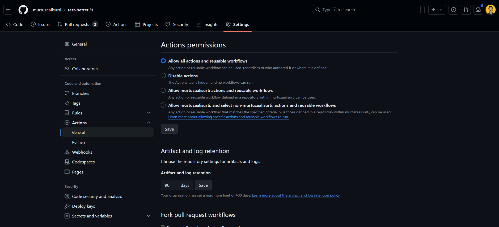

# better

A code reviewer github action powered by AI, ready to be used in your workflow.

## Why use it?

- Standardize your code review process
- Get feedback faster
- Recognize patterns which result in bad code
- Detection of common issues
- Identify security vulnerabilities
- Second opinion
- For humans to focus on more complex tasks

## Usage

### 1. Create a workflow

Create a workflow file inside `.github/workflows` folder (create if it doesn't exist) of your repository with the following content:

```yaml
name: Code Review
on:
    pull_request:
        types: [opened, reopened, synchronize, ready_for_review]
        branches:
            - main # change this to your target branch
    workflow_dispatch: # Allows you to run the workflow manually from the Actions tab

permissions: # necessary permissions
    pull-requests: write
    contents: read

jobs:
    your-job-name:
        runs-on: ubuntu-latest
        name: your-job-name
        steps:
            - name: step-name
              id: step-id
              uses: murtuzaalisurti/better@v1 # this is the ref of the github action - https://docs.github.com/en/actions/writing-workflows/workflow-syntax-for-github-actions#jobsjob_iduses
              with:
                repo-token: ${{ secrets.GITHUB_TOKEN }} # this is auto generated
                ai-model-api-key: ${{ secrets.MODEL_API_KEY }} # make sure to set this in your repository secrets - /settings/secrets/actions (Settings > Secrets and Variables > Actions > Secrets Tab)
                platform: 'openai'
                delete-existing-review-by-bot: true #default is true
                filesToIgnore: '**/*.env, .husky/**' # uses glob patterns (micromatch - https://github.com/micromatch/micromatch)
                rules: |- # Rules to consider for code review
                    -- It must follow industry standard best practices
                    -- It should be idiomatic
                    -- It should be readable
                    -- It should not contain any security related vulnerabilities
                    -- It should not contain any sensitive data
                    -- It should be well structured
                    -- It should not contain bad patterns

```

> [!NOTE]
> The `uses` field refers to which github action to use and what's its reference. For example: `murtuzaalisurti/better@main` means it refers to the `main` branch of the `murtuzaalisurti/better` action. If you want to refer to a specific release or tag, you can specify `murtuzaalisurti/better@v1.0.0` which means it refers to the `v1.0.0` of the `murtuzaalisurti/better` action.

---

### 2. Add your platform API key to your repository secrets

Go to ***your*** repository settings, `Settings > Secrets and Variables > Actions > Secrets Tab` and add your platform API key. For example, add `OPEN_AI_KEY` as a secret with your OpenAI API key as a value. You can refer to it in the workflow file using `${{ secrets.OPEN_AI_KEY }}` against the `ai-model-api-key` field.


---

### 3. Grant permissions

- Go to ***your*** repository settings, `Settings > Actions > General > Actions Permissions Tab` and select `Allow all actions and reusable workflows`.



---

### 4. Run the workflow

Run the workflow by raising a pull request to the target branch mentioned in the `on` section in the workflow.

## Options

### 1. `repo-token`

The `repo-token` is the authorization token of your repository. It is auto generated by GitHub on every workflow run.

---

### 2. `platform`

The `platform` is the name of the AI platform you want to use. It can be either `openai` or `anthropic`.

> *This action only supports ***OpenAI*** and ***Anthropic*** models for now*.

---

### 3. `ai-model-api-key`

The `ai-model-api-key` is your platform's API key which you have set in your repository secrets.

Example:

- `OPEN_AI_KEY` as a secret with your OpenAI API key as a value.
- `ANTHROPIC_KEY` as a secret with your Anthropic API key as a value.

They can be accessed in the workflow file using `${{ secrets.YOUR_KEY_NAME }}`.

---

### 4. `ai-model-name` (Optional)

Specify the name of the model you want to use to generate suggestions. Fallbacks to `gpt-4o-2024-08-06` for OpenAI and `claude-3-5-sonnet-20240620` for Anthropic if not specified. Here's a list of supported models:

For OpenAI:

- `gpt-4o-mini-2024-07-18` and later
- `gpt-4o-2024-08-06` and later

> This project uses [*Structured Outputs*](https://platform.openai.com/docs/guides/structured-outputs/supported-models) and that's why only the above listed models are supported. More info [here](https://platform.openai.com/docs/models).

For Anthropic:

- `claude-3-5-sonnet-20240620`
- `claude-3-opus-20240229`
- `claude-3-sonnet-20240229`
- `claude-3-haiku-20240307`

---

### 5. `delete-existing-review-by-bot` (Optional)

By default, the action will delete any existing review(s) by the bot before creating a new one on every PR push. If you want to keep them, set this option to `false`.

---

### 6. `rules` (Optional)

The rules to consider for code review. It is a multiline text field. Each rule should be on a new line and should start with `--`.

---

### 7. `filesToIgnore` (Optional)

List of files to ignore. It is a comma(`,`) separated list of glob patterns. The default list of ignored files is:

```text
**/node_modules/**,
**/package-lock.json,
**/yarn.lock,
.cache/**,
**/*.{jpg,jpeg,png,svg,webp,avif,gif,ico,woff,woff2,ttf,otf}
```

Glob patterns are resolved using [micromatch](https://github.com/micromatch/micromatch). Check out their documentation for more info.

---

## Things To Note

- The more the pull request changes are in number, higher will be the tokens sent to the AI model and once you reach the token limit either for the model or for the API (rate limiting), the action will throw an error. So, make sure to upgrade your model or the token limit if you encounter an issue which states *too many tokens* or *token limit reached*. Visit OpenAI's or Anthropic's API documentation for more details.
- The [system prompt](https://github.com/murtuzaalisurti/better/blob/main/utils/constants.js#L10) is common across all supported AI models.

> Made with ❤️ by [@murtuzaalisurti](https://github.com/murtuzaalisurti).
